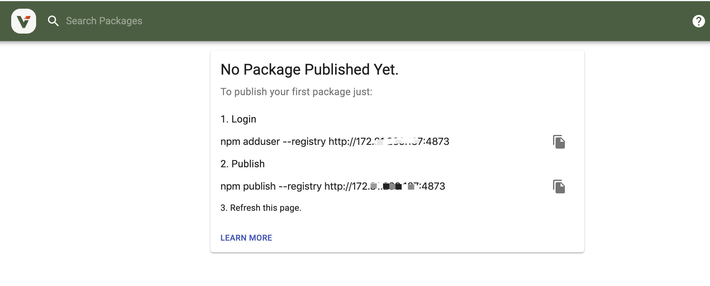

## Refer to: https://verdaccio.org/docs/en/what-is-verdaccio


## Prerequisites
* docker
* docker-compose
* You need create storage diretory in current root directory
  ```
  $ git clone https://github.com/Kubernetes-Best-Pratice/verdaccio.git
  $ cd verdaccio
  $ mkdir storage
  $ chmod 777 storage
  ```

## Diretory Arch
* docker-compose.yml   docker-compose主配置文件, 默认verdaccio的版本是latest
* conf/config.yaml     verdaccio的配置文件
* storage/  verdaccio的存储目录

## How to start

```
$ docker-compose pull
$ docker-compose start
```

## How to check log

```
$ docker-compose logs -f verdaccio
```

_注_: You should make sure you're in the `verdaccio` directory, then you can run commands related to `docker-compose`.

## Then
1. cache npmjs.org
```
$ npm registry http://[verdaccio-ip]:4873
```
_注_: `verdaccio-ip` need change to real ip. 


2. publish package, flow as below



Enjoy it.

## Remove

```
$ docker-compose stop
$ docker-compose rm
```
